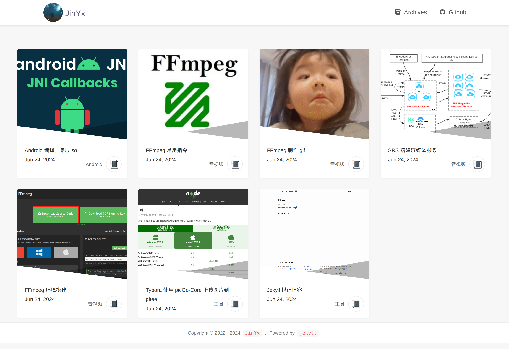

> ruby ^3.0.2p107 (2021-07-07 revision 0db68f0233) [x86_64-linux-gnu]  
> gem ^3.3.5  
> bundle ^Bundler version 2.3.22  
> jekyll ^jekyll 3.9.5  

### 一、安装 ruby

#### 1、ubuntu 包管理器安装

~~~shell
sudo apt-get install ruby-full
~~~

#### 2、源码安装

~~~shell
wget https://cache.ruby-lang.org/pub/ruby/3.0/ruby-3.0.2.tar.gz
tar -xvf ruby-3.0.2.tar.gz
cd ruby-3.0.2
# 添加 --prefix=DIR 安装到指定目录
./configure
make
sudo make install
~~~

&emsp;&emsp;其他平台安装参考[官方文档](https://www.ruby-lang.org/zh_cn/documentation/installation/)

### 二、替换 gems 默认源

~~~shell
# 添加镜像源并移除默认源
gem sources --add https://gems.ruby-china.com/ --remove https://rubygems.org/
# gem sources --add https://mirrors.cernet.edu.cn/rubygems/ --remove https://rubygems.org/
# 列出已有源
gem sources -l
~~~

### 三、安装 jekyll

~~~shell
sudo gem install jekyll bundler
# 安装完 bundle 后默认源还是 https://rubygems.org/
bundle config mirror.https://rubygems.org https://gems.ruby-china.com/
# bundle config mirror.https://rubygems.org https://mirrors.cernet.edu.cn/rubygems
~~~

### 四、启动服务

~~~shell
# 任选一个启动即可
bundle exec jekyll server
jekyll server
jekyll server -w --host 0.0.0.0
~~~

&emsp;&emsp;一般来说第一次无法正常启动，需要安装依赖

~~~shell
bundle install
# 如果安装 error，简单的方式是使用 sudo；虽然官方不建议 Don't run Bundler as root.
sudo bundle install
~~~

&emsp;&emsp;如果提示需要的版本不对的情况

~~~shell
# 列出已安装版本
gem list [gemname]
# 安装指定版本
gem install [gemname] --version [version]
# 卸载指定版本
gem uninstall [gemname] --version [version]
~~~

&emsp;&emsp;解决完依赖后再启动服务，看到如下输出时则可以访问 [http://127.0.0.1:4000](http://127.0.0.1:4000)

~~~shell
       Jekyll Feed: Generating feed for posts
                    done in 0.24 seconds.
 Auto-regeneration: enabled for '/path/blog-jekyll'
    Server address: http://127.0.0.1:4000
  Server running... press ctrl-c to stop.
~~~

