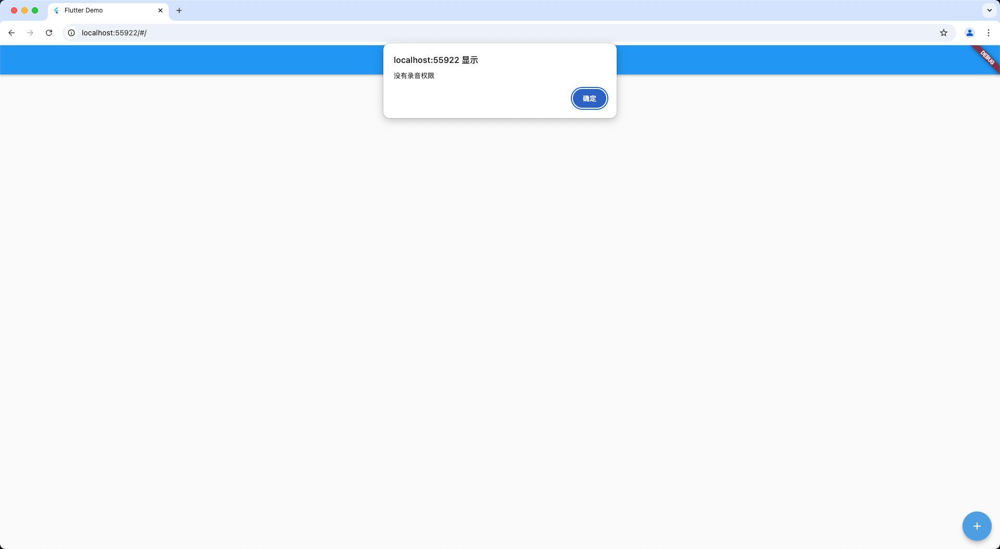

* content
{:toc}

&emsp;&emsp;dart 调用 js 的 [同步函数](#function_sync) 和 [异步函数](#function_async) 方式不同，
但都需要将创建的 js 文件在 `web/index.html` 中引入。

~~~html
<head>
  
  
</head>
~~~

<h3 id="funtion_sync">一、dart 调用 js 同步函数</h3>

~~~javascript
function showAlert(message) {
    alert(message);
}
~~~

&emsp;&emsp;定义上面的 js 函数接收参数显示弹窗，dart 函数中使用 `dart:js` 包的 callMethod() 方法调用 js 函数；
第一个参数是 js 的函数名；第二个参数为对应 js 函数的参数列表；返回值对应 js 函数的返回值。

~~~dart
import 'dart:js';

void showAlert(String message) {
  context.callMethod("showAlert", [message]);
}
~~~

<h3 id="funtion_async">二、dart 调用 js 异步函数</h3>

&emsp;&emsp;异步函数调用因为 js 中是 `Promise`，Flutter 中是 `Future`，因此需要额外导入 [js 库](https://pub.dev/packages/js)，将 promise 转 future。

~~~yaml
dependencies:
  js: ^0.7.1
~~~

&emsp;&emsp;定义如下 js 函数，用于申请录音权限，返回一个 `Promise` 对象。

~~~javascript
function requestAudioPermission() {
    if (navigator.mediaDevices) {
        const promise = navigator.mediaDevices.getUserMedia({audio: true, video: false});
        return new Promise((resolve, reject) => {
            promise.then(() => {
                resolve(true);
            }).catch((err) => {
                resolve(false);
            });
        });
    } else {
        return new Promise((resolve, reject) => {
            reject("该浏览器不支持媒体设备");
        });
    }
}
~~~

&emsp;&emsp;异步 js 函数，使用 `@JS()` 定义 js 函数，该函数返回 promise 对象，通过 `dart:js_util` 包的 promiseToFuture() 方法将 js 的 promise 转为 flutter 的 future 从而得到回调值或异常。

~~~dart
import 'dart:js';
import 'dart:js_util';

import 'package:js/js.dart';

void showAlert(String message) {
  context.callMethod("showAlert", [message]);
}

@JS()
external requestAudioPermission();

void checkRecordPermission() {
  promiseToFuture(requestAudioPermission()).then((isGrant) {
    if (isGrant) {
      showAlert("获取到录音权限，创建录音机");
    } else {
      showAlert("没有录音权限");
    }
  }, onError: (err) => showAlert(err));
}
~~~

