* content
{:toc}
## 一、Unity 视频播放控制

&emsp;&emsp;创建一个 Unity 项目，实现一个点击按钮控制视频播放开始、暂停的功能

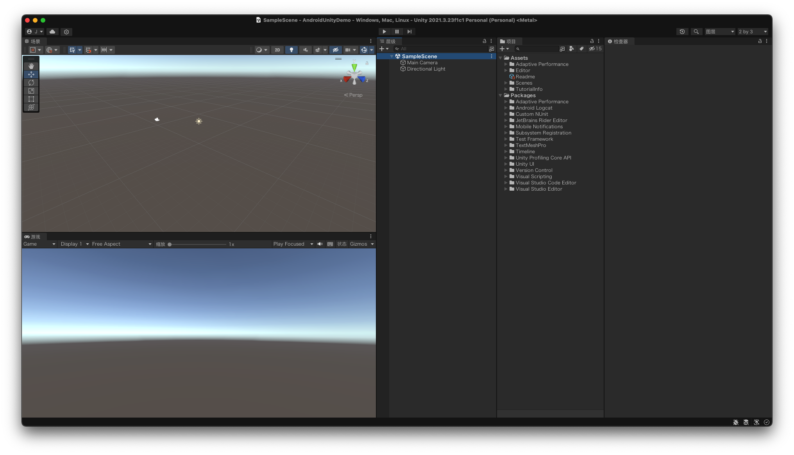

&emsp;&emsp;右键 `Scene`，创建一个 `Canvas`

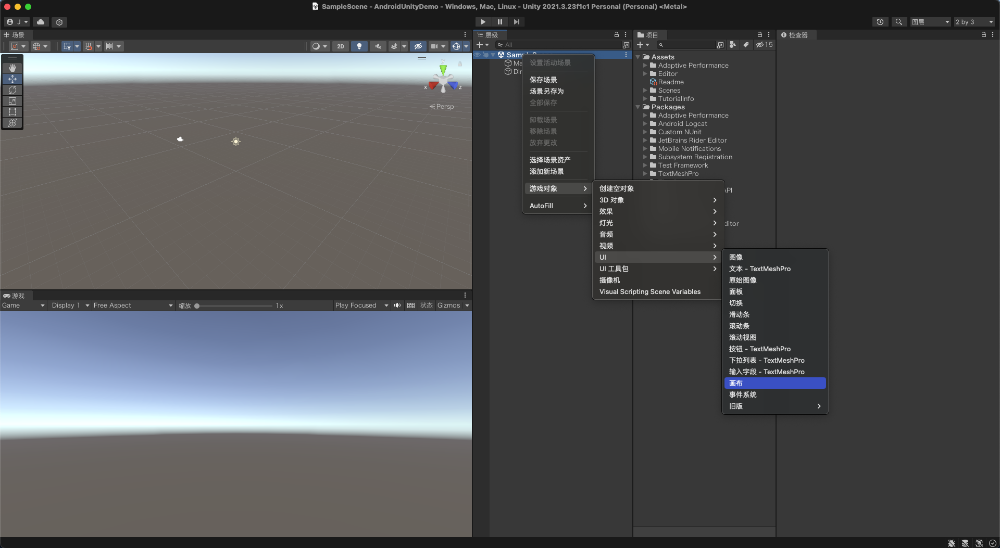

&emsp;&emsp;继续在画布下创建一个 `Panel`

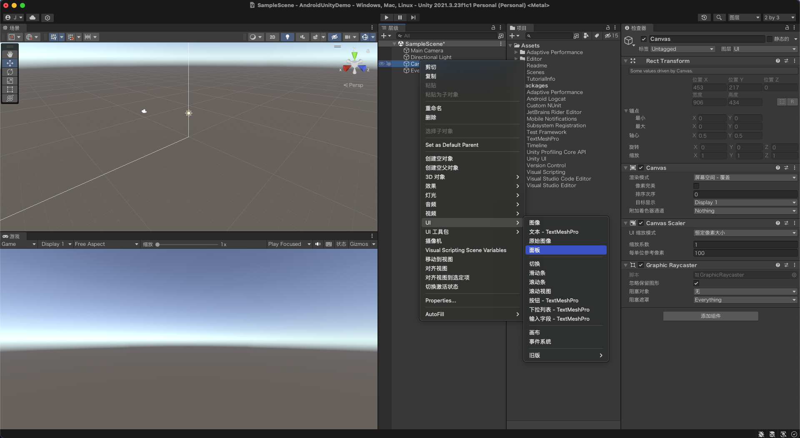

&emsp;&emsp;移除画板下的 `Image` 组件

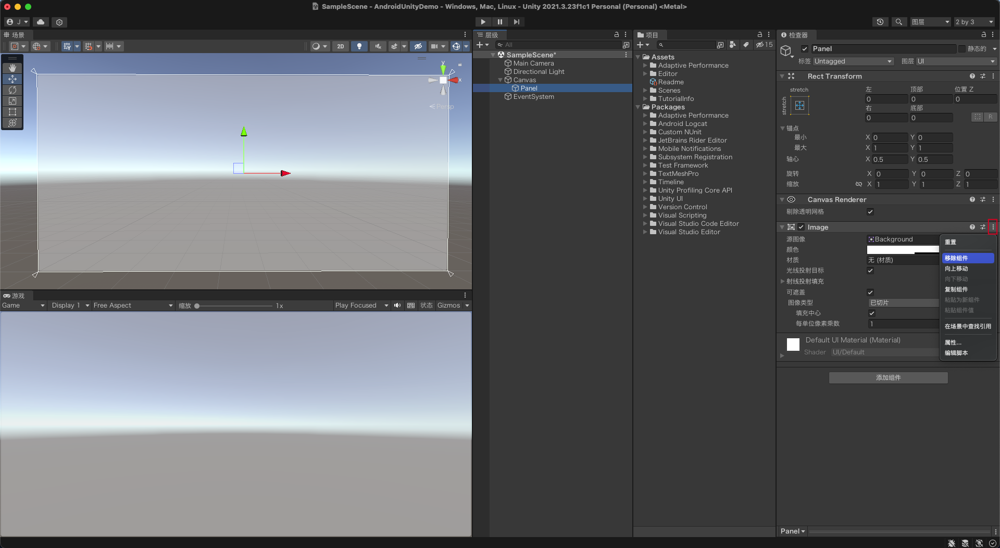

&emsp;&emsp;在画板下创建一个 `Raw Image` 物体用于显示视频

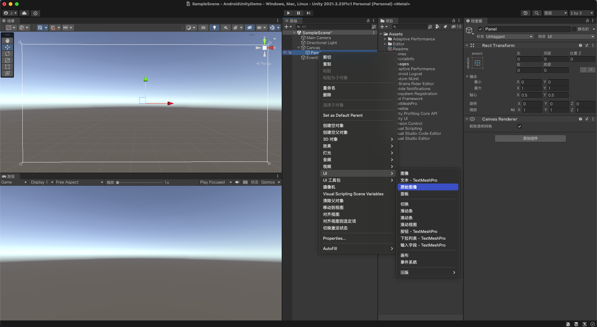

&emsp;&emsp;点击 `Raw Image` 中的锚点设置，在打开的 `锚点预设` 面板上按住 `Alt` + `Shift`，选择最后一个，使 `Raw Image` 占满 `Panel` 画板

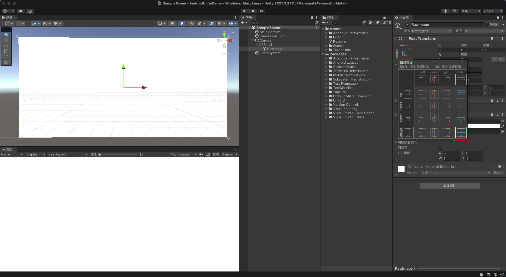

&emsp;&emsp;同样在画板下再创建一个 `Button` 物体用于控制视频播放，此处选择的是旧版的按钮物体

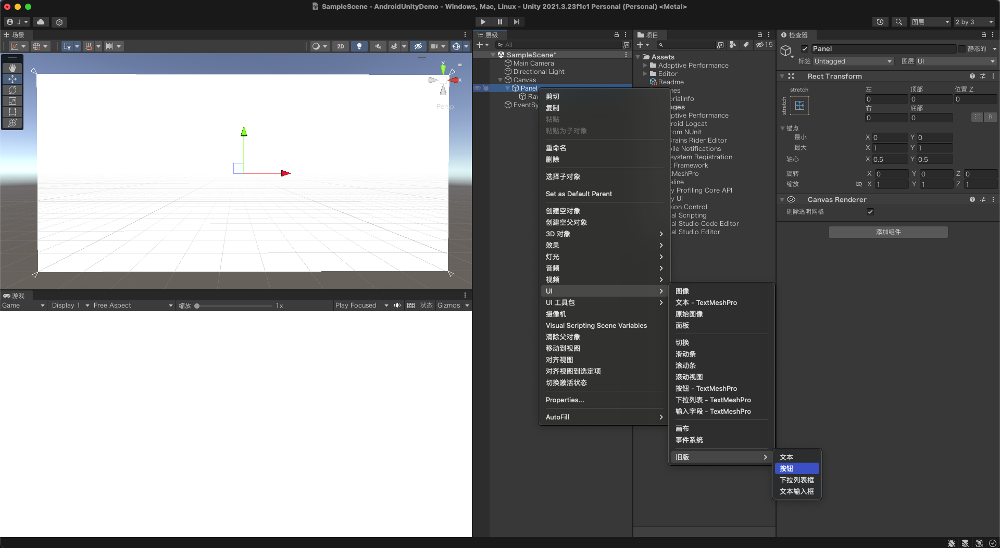

&emsp;&emsp;也点击锚点设置图标，只用按住 `Alt` 选择 `bottom right`，将按钮的位置设置到右下角贴边

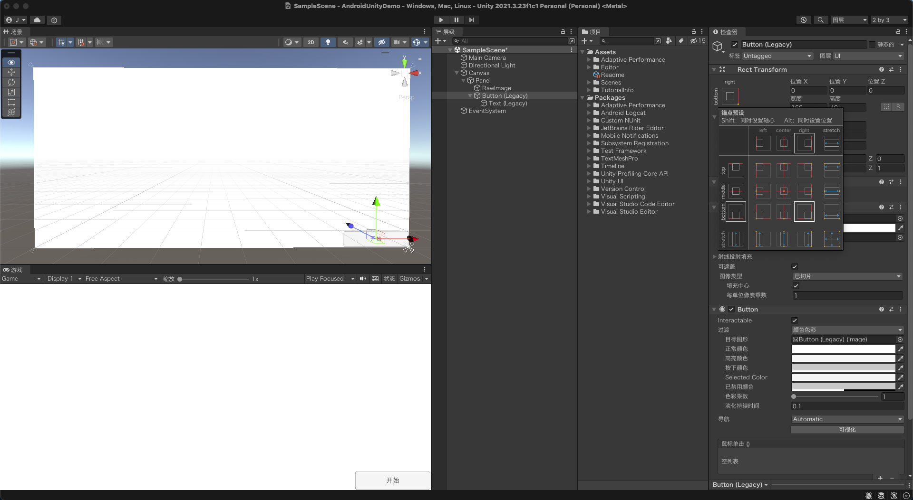

&emsp;&emsp;展开 `Button` 物体，点击其 `Text` 子物体，在 `Text` 组件中设置按钮默认文字为 `开始`，并可以调整字体大小、颜色、对齐方式等样式效果

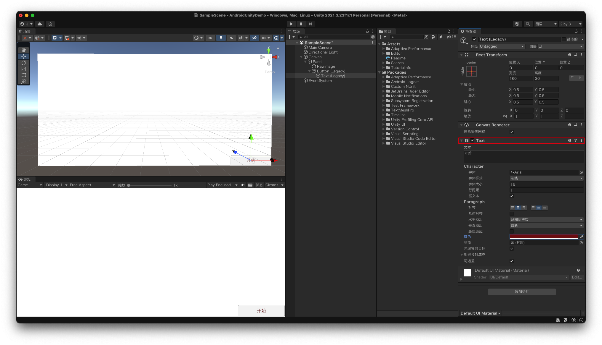

&emsp;&emsp;在项目的 Assets 目录下创建三个文件夹：`Renders`、`Res`、`Scripts`；分别存放视频播放的 `渲染器纹理`、播放的 `视频文件` 和 控制视频播放的 `脚本文件`

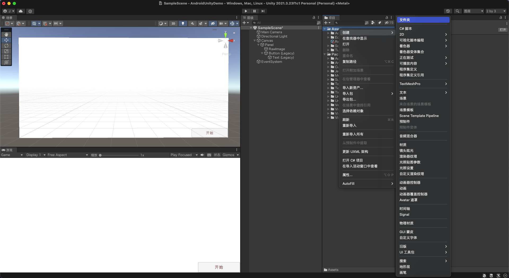

&emsp;&emsp;首先在 `Renders` 文件夹下创建一个 `Render Texture` 渲染器纹理，用于显示视频画面

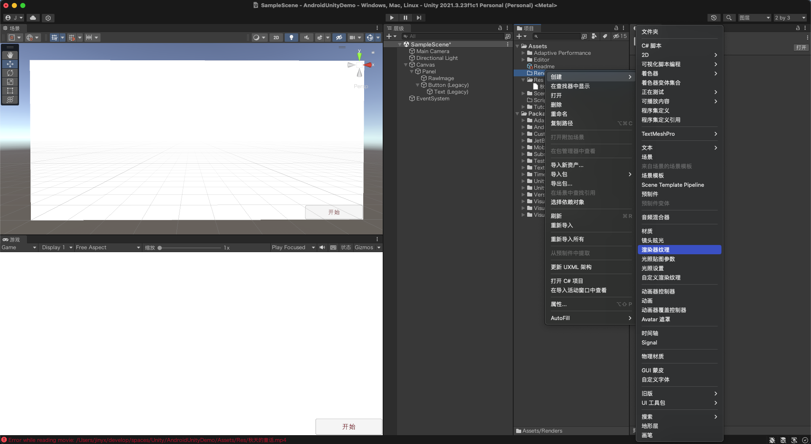

&emsp;&emsp;并将渲染器纹理的尺寸大小设置为视频的分辨率大小，同样的，视频文件也放在了 `Res` 文件夹下

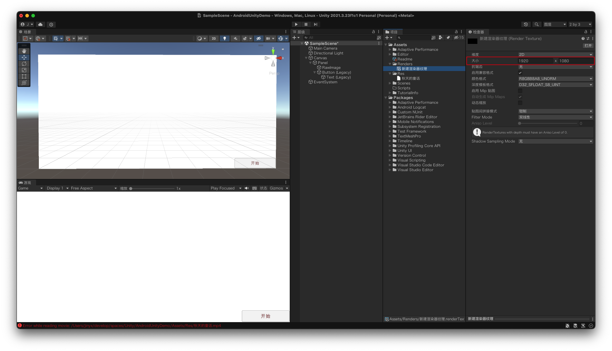

&emsp;&emsp;在 `Scripts` 文件夹下创建一个名为 `VideoController` 的 C# 脚本，用于控制视频播放

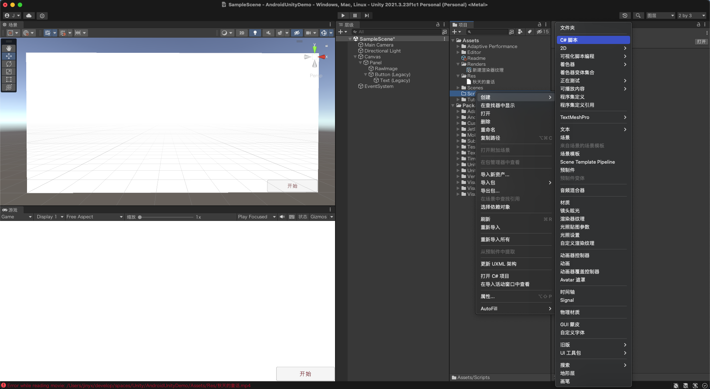

&emsp;&emsp;脚本内容如下：

~~~csharp
using System.Collections;
using System.Collections.Generic;
using UnityEngine;
using UnityEngine.UI;
using UnityEngine.Video;

public class VideoController : MonoBehaviour {

    public VideoPlayer videoPlayer;
    public Text buttonText;

    public void OnVideoPlayOrPause() {
        if (videoPlayer.isPlaying) {
            videoPlayer.Pause();
            buttonText.text = "开始";
        } else {
            videoPlayer.Play();
            buttonText.text = "停止";
        }
    }
}
~~~

&emsp;&emsp;`VideoPlayer` 和 `Text` 组件分别控制视频的播放暂停和文本在播放暂停时显示的文字，`OnVideoPlayOrPause` 方法为 `Button` 的点击事件，点击时控制视频的播放和暂停

&emsp;&emsp;点击 `Raw Image` 物体，添加 `VideoPlayer` 组件，并将上面创建的纹理和视频文件拖拽到如下的对应位置

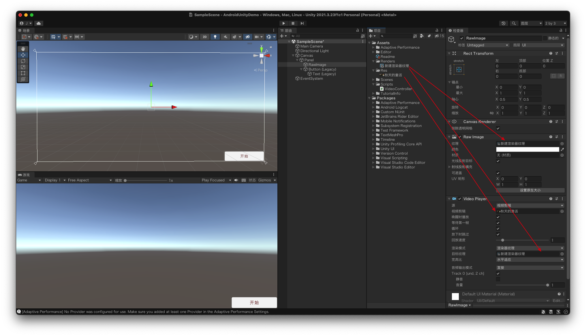

&emsp;&emsp;点击 `Button` 物体，将创建的 `VideoController` 脚本绑定在其上，将脚本中定义的 `VideoPlayer` 和 `Text` 组件和游戏物体对应上；即拖动 `Raw Image(含 VideoPlayer 组件)` 到 videoPlayer 属性，拖动 `Text(含 Text 组件)` 物体到 buttonText 属性。

&emsp;&emsp;另外 `Button` 组件的点击事件，Object 选择绑定 `VideoController` 脚本的 `Button` 物体，Function 选择 `VideoController` 脚本中的 `OnVideoPlayOrPause` 方法

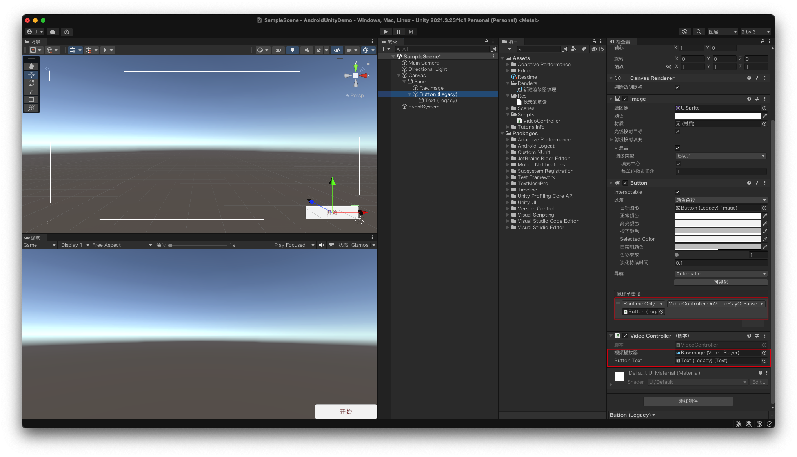

&emsp;&emsp;上面配置完了后，点击运行按钮，即可在 `Game` 面板中看到视频播放的效果，点击右下角的按钮改变播放状态和文本

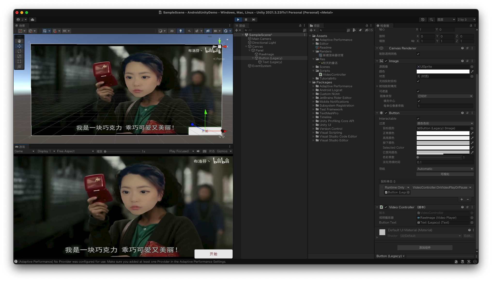

## 二、打包 apk

&emsp;&emsp;打开 Unity 的 `Perferences` 设置面板，根据下方提示修改 Android 相关配置；

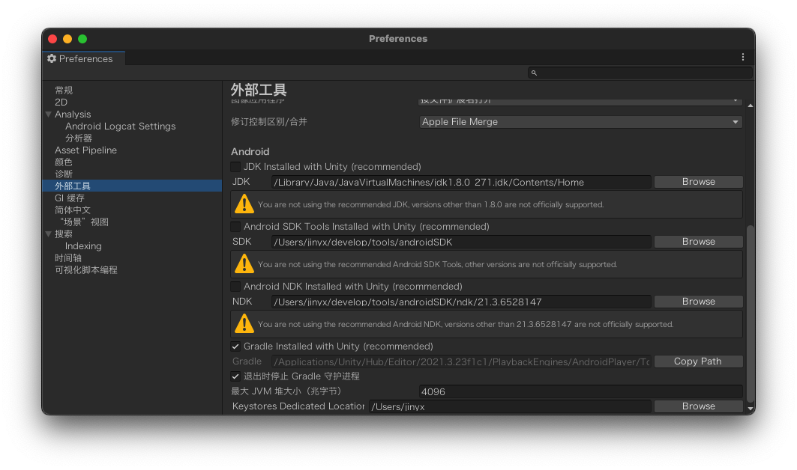

&emsp;&emsp;再点击 `File` -> `Build Settings`，在打开的面板中，切换平台到 Android，点击 `Build` 生成 apk 文件；

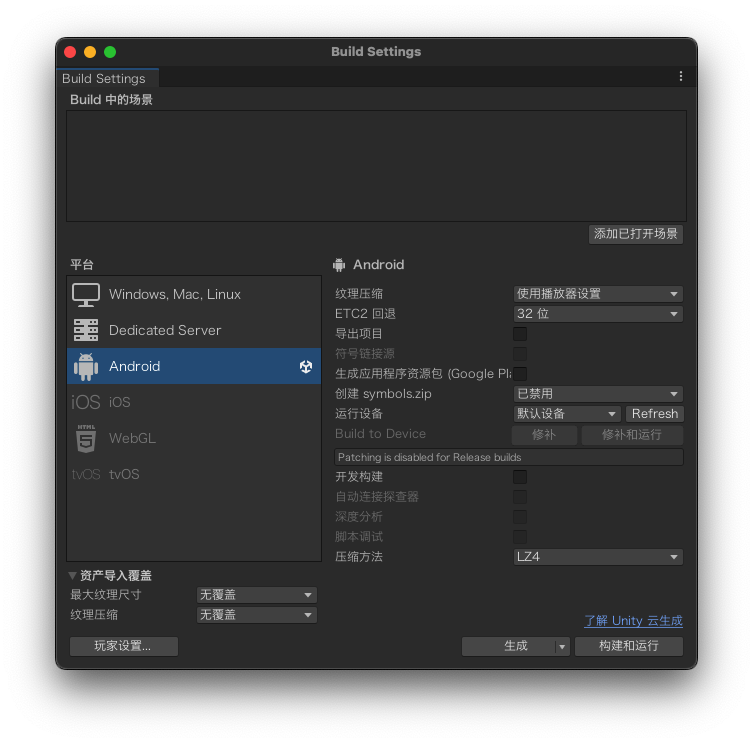

&emsp;&emsp; apk 运行效果

## 三、导出为 Android Studio 项目

&emsp;&emsp;同样打开 `Build Settings` 面板，平台切换到 Android，勾选上 `Export Project`，点击 `Export` 将项目导出到一个空目录，生成的文件结构如下；

~~~javascript
.
├── build.gradle
├── gradle
│   └── wrapper
│       └── gradle-wrapper.properties
├── gradle.properties
├── launcher
│   ├── build.gradle
│   └── src
│       └── main
│           ├── AndroidManifest.xml
│           └── res
├── local.properties
├── settings.gradle
└── unityLibrary
    ├── build.gradle
    ├── libs
    │   └── unity-classes.jar
    ├── proguard-unity.txt
    └── src
        └── main
            ├── AndroidManifest.xml
            ├── assets
            ├── java
            ├── jniLibs
            ├── res
            └── resources
~~~

&emsp;&emsp;打开 Android Studio，点击 `File` -> `New` -> `Import Project…`，选择刚刚导出的文件目录，导入到 Android 项目；Gradle 同步后可以正常运行

`unityLibrary/src/main/java/com/unity3d/player/UnityPlayerActivity.java` 中的 `boolean onKeyUp(int, KeyEvent)` 方法修改如下，点击返回按钮时不见事件注入到 Unity，从而可以返回退出应用

~~~java
@Override public boolean onKeyUp(int keyCode, KeyEvent event)     {
    if (keyCode == KeyEvent.KEYCODE_BACK) {
        super.onBackPressed();
        return true;
    } else {
        return mUnityPlayer.injectEvent(event);
    }
}
~~~

