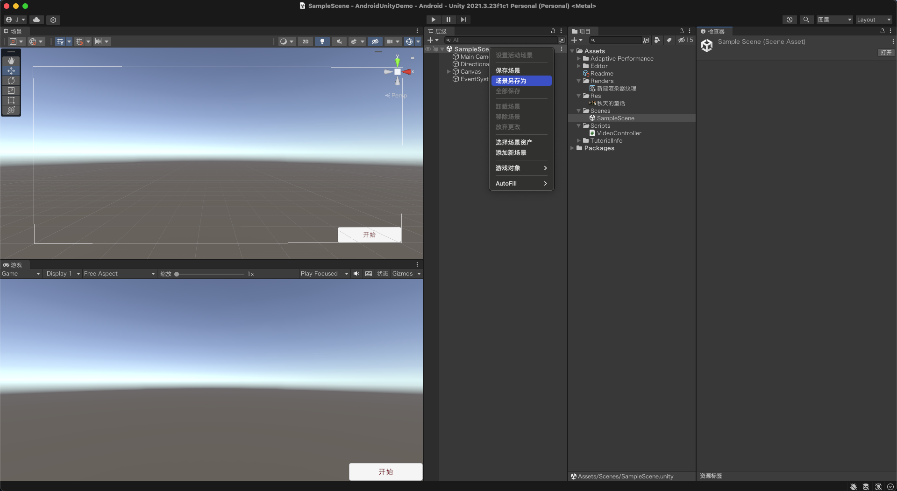
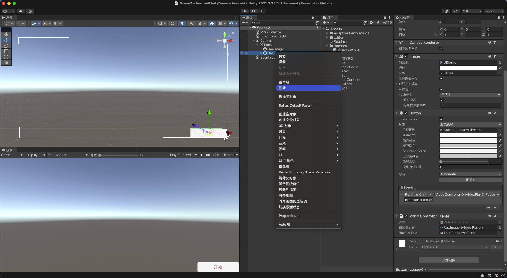
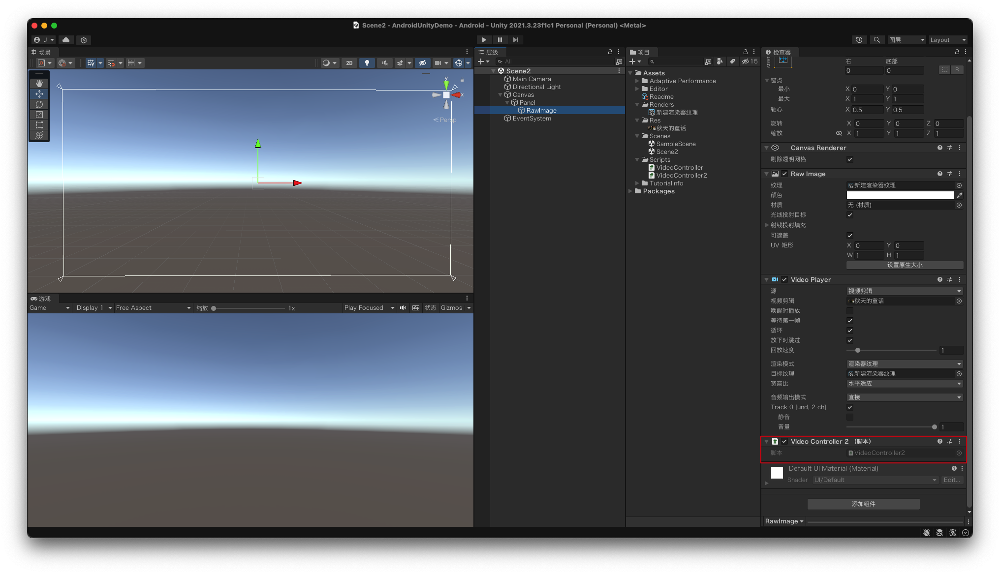
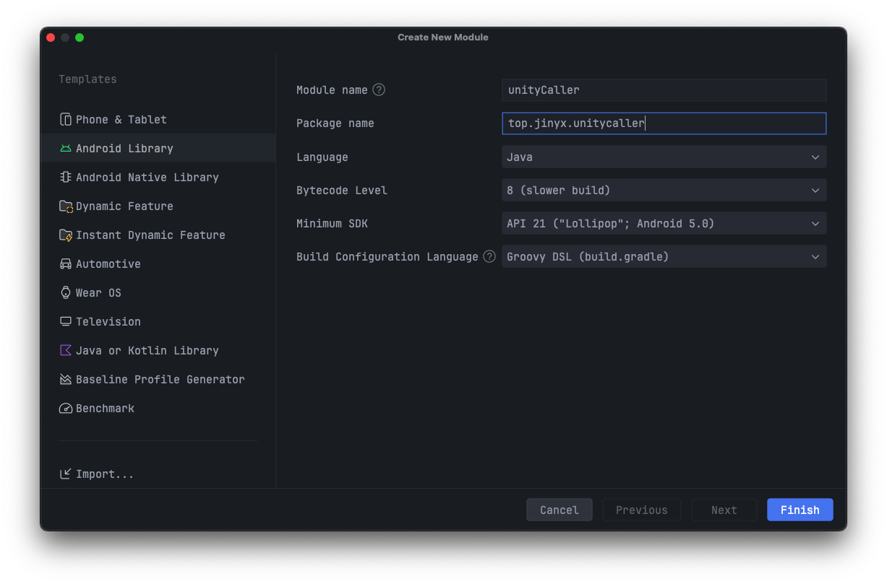
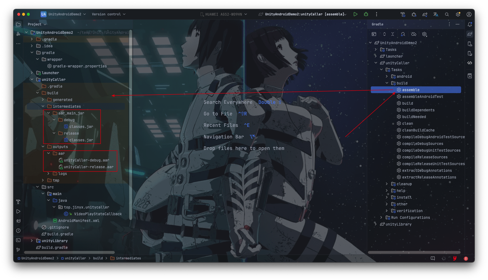
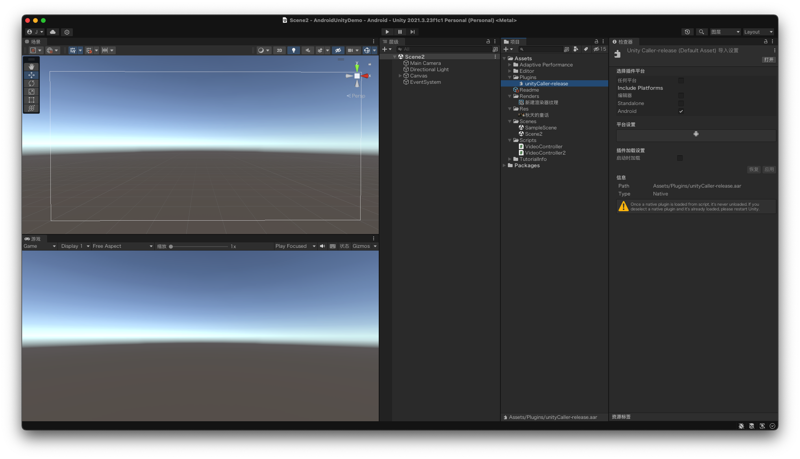

* content
{:toc}

&emsp;&emsp;上一篇介绍了 [Unity 打包 apk 和导出为 Android 项目](./Unity-Android)，这篇实现 Android 与 Unity 之间的交互。

&emsp;&emsp;还是以上篇文章的 Unity 项目为例，去除其控制按钮，交由 Android 端进行控制实现

## 一、Unity 移除控制按钮

&emsp;&emsp;右键当前 `Scene` -> `Save Scene As` 另存以重新复制出一份场景

&emsp;&emsp;右键 `Button` 物体，将其删除，其对应绑定的 `VideoController` 脚本也被解除绑定

&emsp;&emsp;Android 中需要控制视频的播放暂停，同样需要类似的脚本控制 `VideoPlayer` 组件的播放暂停，但不再需要修改按钮物体的文本，因此重新创建一份脚本如下

~~~csharp
using System.Collections;
using System.Collections.Generic;
using UnityEngine;
using UnityEngine.Video;

public class VideoController2 : MonoBehaviour {

    private VideoPlayer videoPlayer;

    void Start() {
        videoPlayer = GetComponent<VideoPlayer>();
    }
    
    public void OnVideoPlayOrPause() {
        if (videoPlayer.isPlaying) {
            videoPlayer.Pause();
        } else {
            videoPlayer.Play();
        }
    }

}
~~~

&emsp;&emsp;将创建的 `VideoController2` 脚本绑定到 `RawImage` 物体上，脚本中的 `VideoPlayer` 组件通过 `GetComponent()` 从当前物体中获取

&emsp;&emsp;打开 `Build Settings` 面板，将当前场景的 Unity 导出为 Android 项目

## 二、Android 调用 Unity 脚本方法

&emsp;&emsp;将 Unity 导出的 Android 项目导入到 Android Studio 中，主启动 Activity 可以在 `unityLibrary` 模块的清单文件中看到，为 `com.unity3d.player.UnityPlayerActivity`

~~~java
@Override
protected void onCreate(Bundle savedInstanceState) {
    requestWindowFeature(Window.FEATURE_NO_TITLE);
    super.onCreate(savedInstanceState);

    String cmdLine = updateUnityCommandLineArguments(getIntent().getStringExtra("unity"));
    getIntent().putExtra("unity", cmdLine);

    mUnityPlayer = new UnityPlayer(this, this);
    setContentView(mUnityPlayer);
    mUnityPlayer.requestFocus();
}
~~~

&emsp;&emsp;通过 `UnityPlayerActivity` 的 `onCreate()` 方法，可以看到当前页面是 `UnityPlayer` 对象，继承自 FrameLayout；

&emsp;&emsp;因此我们可以通过 frameLayout.addView() 在视频播放的上层右下角添加一个播放按钮，如下

~~~java
@Override
protected void onCreate(Bundle savedInstanceState) {
    // ...
    mUnityPlayer = new UnityPlayer(this, this);
    // 设置屏幕常亮
    mUnityPlayer.setKeepScreenOn(true);
    addPlayButton();
    setContentView(mUnityPlayer);
}

private void addPlayButton() {
    Button button = new Button(this);
    button.setPadding(36, 10, 36, 10);
    button.setText("开始");
    button.setTextSize(16);
    button.setOnClickListener(v -> UnityPlayer.UnitySendMessage("RawImage", "OnVideoPlayOrPause", ""));
    FrameLayout.LayoutParams layoutParams = new FrameLayout.LayoutParams(
        FrameLayout.LayoutParams.WRAP_CONTENT, FrameLayout.LayoutParams.WRAP_CONTENT
    );
    layoutParams.gravity = Gravity.BOTTOM | Gravity.END;
    mUnityPlayer.addView(button, layoutParams);
}
~~~

&emsp;&emsp;按钮的点击事件调用 `UnityPlayer.UnitySendMessage("RawImage", "OnVideoPlayOrPause", "")` 完成和 Unity 的交互；

&emsp;&emsp;该方法接收三个参数，分别对应 `脚本绑定的游戏物体`、`调用的脚本方法`、`方法的参数`，其中参数只能是无参或一个参数;

&emsp;&emsp;`UnityPlayer` 类在 `unityLibrary/libs/unity-classes.jar` 中。

&emsp;&emsp;运行后点击右下角的按钮，同样也实现了视频的播放和暂停；但是 `UnitySendMessage` 没有返回值或回调接口，因此无法得知当前播放状态，从而更新按钮文本

## 三、Unity 调用 Android 方法更新播放状态

&emsp;&emsp;在 Android 项目中创建一个 Library 模块，其中定义供 Unity 调用的接口；

&emsp;&emsp;例如下方的代码，提供 `void changePlayState(boolean isPlaying)` 接口供 Unity 调用，接收到 Unity 传过来的播放状态之后，通过广播进行通知；

~~~java
package top.jinyx.unitycaller;

import android.content.Context;
import android.content.Intent;
import android.os.Build;
import android.util.Log;

import java.lang.reflect.Field;

/**
 * @Author: JinYx
 * @Create: 2024-08-27 15:33:31
 * @Signature: 不属于这个时代的愚者；灰雾之上的神秘主宰；执掌好运的黄黑之王。
 */
public class VideoPlayStateCallback {

    public static final String ACTION = "top.jinyx.unitycaller.VIDEO_PLAY_STATE";
    public static final String EXTRA_PLAY_STATE = "video_play_state";

    private Context context;

    public VideoPlayStateCallback() {
        try {
            Class clazz = Class.forName("com.unity3d.player.UnityPlayer");
            Field field = clazz.getDeclaredField("currentActivity");
            field.setAccessible(true);
            context = (Context) field.get(clazz);
        } catch (Exception e) {
            context = null;
        }
    }

    public void changePlayState(boolean isPlaying) {
        if (context != null) {
            Intent intent = new Intent(ACTION);
            if (Build.VERSION.SDK_INT >= Build.VERSION_CODES.O) {
                intent.setPackage(context.getPackageName());
            }
            intent.putExtra(EXTRA_PLAY_STATE, isPlaying);
            context.sendBroadcast(intent);
        } else {
            Log.i("UnityAndroid", "context is null, cant send broadcast");
        }
    }
}
~~~

&emsp;&emsp;打开 Android Studio 的 gradle 面板，双击 Library 模块 `unityCaller` 的 `build/assemble`，
将会在该模块的 `build` 目录下生成 `jar` 包和 `aar` 包

&emsp;&emsp;因为上面导出的 `unityCaller` 模块只存在 java 类，不含资源文件和第三方依赖等，因此 Unity 中使用 jar 或 aar 都可；

&emsp;&emsp;在 Unity 的 Assets 下创建 Plugins 文件夹，将打包的 jar 或 aar 包放入该文件夹下即可

&emsp;&emsp;修改 `VideoController2` 脚本，通过 [AndroidJavaObject](https://docs.unity3d.com/2021.3/Documentation/ScriptReference/AndroidJavaObject.html) 调用 Android 提供的方法

~~~csharp
using System.Collections;
using System.Collections.Generic;
using UnityEngine;
using UnityEngine.Video;

public class VideoController2 : MonoBehaviour {

    private VideoPlayer videoPlayer;
    private AndroidJavaObject ajo;

    void Start() {
        videoPlayer = GetComponent<VideoPlayer>();

        ajo = new AndroidJavaObject("top.jinyx.unitycaller.VideoPlayStateCallback");
    }
    
    public void OnVideoPlayOrPause() {
        if (videoPlayer.isPlaying) {
            videoPlayer.Pause();
        } else {
            videoPlayer.Play();
        }
        ajo.Call("changePlayState", videoPlayer.isPlaying);
    }

}
~~~

&emsp;&emsp;重新导出 Unity 的 Android 项目，在 Android 中注册广播接收器，监听播放状态修改 Button 的文本

~~~java
import android.content.BroadcastReceiver;
import android.content.Context;
import android.content.Intent;
import android.util.Log;
import android.widget.Button;

import top.jinyx.unitycaller.VideoPlayStateCallback;

public class VideoPlayStateReceiver extends BroadcastReceiver {

    private final Button button;

    public VideoPlayStateReceiver(Button button) {
        this.button = button;
    }

    @Override
    public void onReceive(Context context, Intent intent) {
        if (VideoPlayStateCallback.ACTION.equals(intent.getAction())) {
            boolean isPlaying = intent.getBooleanExtra(VideoPlayStateCallback.EXTRA_PLAY_STATE, false);
            if (isPlaying) {
                button.setText("暂停");
            } else {
                button.setText("开始");
            }
        }
    }
}
~~~

~~~java
private void registerReceiver() {
    videoPlayStateReceiver = new VideoPlayStateReceiver(button);
    IntentFilter intentFilter = new IntentFilter(VideoPlayStateCallback.ACTION);
    if (Build.VERSION.SDK_INT >= Build.VERSION_CODES.UPSIDE_DOWN_CAKE) {
        registerReceiver(videoPlayStateReceiver, intentFilter, Context.RECEIVER_NOT_EXPORTED);
    } else {
        registerReceiver(videoPlayStateReceiver, intentFilter);
    }
}
~~~

📢 有关 Unity 调用 Android 接口的详细使用，见 Unity 官方文档:

- [AndroidJavaClass](https://docs.unity3d.com/2021.3/Documentation/ScriptReference/AndroidJavaClass.html)
- [AndroidJavaObject](https://docs.unity3d.com/2021.3/Documentation/ScriptReference/AndroidJavaObject.html)