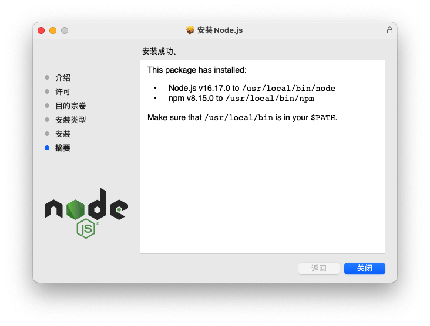
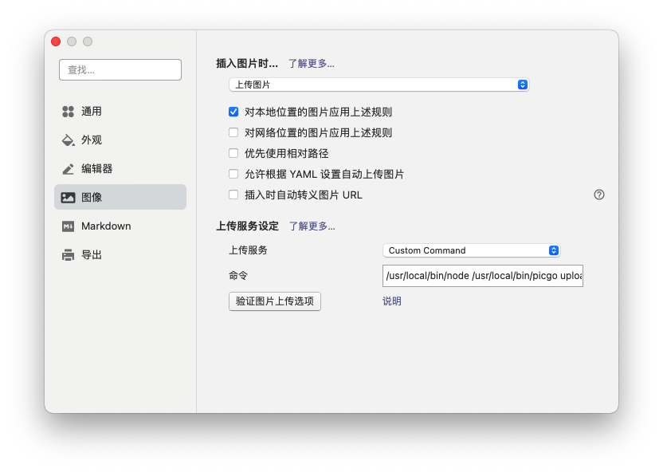

* content
{:toc}

> **系统：MacOS**

## 一、安装 node.js

&emsp;&emsp;前往 [node.js](https://nodejs.org/zh-cn/download/) 官网下载页面，下载对应平台的安装包，双击安装包，安装页面一直继续下一步即可完成安装；安装完成之后，安装路径 `/usr/local/bin/node` 将在 typora 图像上传命令中需要用到；也可以通过 `which node` 查看 node.js 的安装路径

&emsp;&emsp;npm 配置淘宝镜像，或者安装 cnpm 配置淘宝镜像

~~~sh
npm config set registry https://registry.npm.taobao.org

npm install -g cnpm --registry=https://registry.npm.taobao.org
~~~

## 二、创建 gitee 仓库

&emsp;&emsp;在 gitee 上新建一个仓库，勾选 readme 模板，因为需要在仓库设置中将其修改成 `开源` 公开状态，而空仓库不允许修改。

&emsp;&emsp;点击 gitee 头像，打开设置页面，选择 [私人令牌](https://gitee.com/profile/personal_access_tokens) 页面，点击生成新令牌；在提交令牌时，会出现一个确认弹窗，提醒要复制并保存好该令牌；

## 三、安装 picGo-Core

~~~sh
# 安装 picGo-Core
npm install picgo -g

# 安装 picGo-Core 插件
picgo install picgo-plugin-super-prefix
picgo install gitee-uploader
~~~

&emsp;&emsp;安装完成之后，通过 `which picgo` 查看安装目录，例如 `/usr/local/bin/picgo`，同上面 `node` 路径，将用于 Typora 图像上传命令中。

&emsp;&emsp;修改 picgo 的配置文件 `~/.picgo/config.json`:

~~~json
{
  "picBed": {
    "uploader": "gitee",
    "gitee": {
      "repo": "Jin-Yx/image-store",
      "token": "gitee 的访问令牌",
      "path": "",
      "customUrl": "",
      "branch": ""
    }
  },
  "picgoPlugins": {
    "picgo-plugin-gitee-uploader": true,
    "picgo-plugin-super-prefix": true
  },
  "picgo-plugin-super-prefix": {
    "fileFormat": "YYYYMMDDHHmmss"
  }
}
~~~

## 四、Typora 图像上传设置

&emsp;&emsp;打开 typora 的设置页面，选择图像设置；**插入图片时…:** 可以设置为 `上传图片`，这样往 typora 中拖入图片时，将会自动上传；也可以选择 `无特殊操作`，之后在 typora 中手动右键图片选择 **上传图片**

&emsp;&emsp;**上传服务设定**: 将 `上传服务` 设定为 **Custom Command**，而不是 **picgo**；`命令` 处填写 **[node 路径] [picgo 路径] upload**；点击 `验证图片上传选项` 按钮，验证图片是否可以正常上传到 gitee 仓库中

