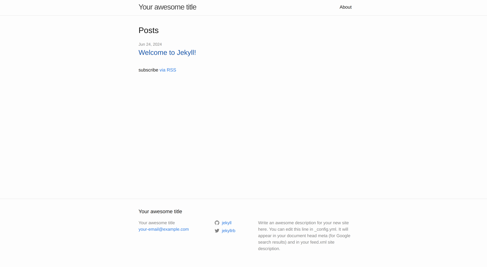

* content
{:toc}

## 一、安装 ruby

#### 1、ubuntu 包管理器安装

~~~shell
sudo apt-get install ruby-full
# 安装完后查看版本，例如: ruby 3.0.2p107 (2021-07-07 revision 0db68f0233) [x86_64-linux-gnu]
ruby -v
# 3.3.5
gem -v
~~~

#### 2、源码安装

~~~shell
wget https://cache.ruby-lang.org/pub/ruby/3.0/ruby-3.0.2.tar.gz
tar -xvf ruby-3.0.2.tar.gz
cd ruby-3.0.2
# 添加 --prefix=DIR 安装到指定目录
./configure
make
sudo make install
~~~

&emsp;&emsp;其他平台安装参考[官方文档](https://www.ruby-lang.org/zh_cn/documentation/installation/)

## 二、替换 gems 默认源

~~~shell
# 添加镜像源并移除默认源
gem sources --add https://gems.ruby-china.com/ --remove https://rubygems.org/
# gem sources --add https://mirrors.cernet.edu.cn/rubygems/ --remove https://rubygems.org/
# 列出已有源
gem sources -l
~~~

## 三、jekyll 搭建博客

#### 1、安装 jekyll

~~~shell
sudo gem install jekyll bundler
# 安装完 bundle 后默认源还是 https://rubygems.org/
bundle config mirror.https://rubygems.org https://gems.ruby-china.com/
# bundle config mirror.https://rubygems.org https://mirrors.cernet.edu.cn/rubygems
~~~

#### 2、创建博客

~~~shell
jekyll new myblog
cd myblog
bundle exec jekyll server
~~~

&emsp;&emsp;不出意外会提示一些依赖库不存在

~~~shell
Could not find ... in locally installed gems
Run `bundle install` to install missing gems.
~~~

#### 3、安装依赖

~~~shell
bundle install
# 如果安装 error，简单的方式是使用 sudo；虽然官方不建议 Don't run Bundler as root.
sudo bundle install
# 安装完依赖后重新启动
bundle exec jekyll server
~~~

&emsp;&emsp;除开依赖还可能版本不匹配，可通过如下方式安装对应版本的依赖库

~~~shell
# 列出已安装版本
gem list [gemname]
# 安装指定版本
gem install [gemname] --version [version]
# 卸载指定版本
gem uninstall [gemname] --version [version]
~~~

#### 4、启动服务

&emsp;&emsp;见到如下输出表明服务启动成功，此时打开浏览器访问 [http://127.0.0.1:4000/](http://127.0.0.1:4000/) 即可看到默认很简陋的一个网页

~~~shell
Run in verbose mode to see all warnings.
                    done in 0.26 seconds.
 Auto-regeneration: enabled for '/path/myblog'
    Server address: http://127.0.0.1:4000/
  Server running... press ctrl-c to stop.
~~~

## 四、jekyll 主题

&emsp;&emsp;除了默认的效果，还可以从 [jekyll 主题](https://jekyllrb.com/docs/themes/) 中下载喜欢的主题模版来进行修改

