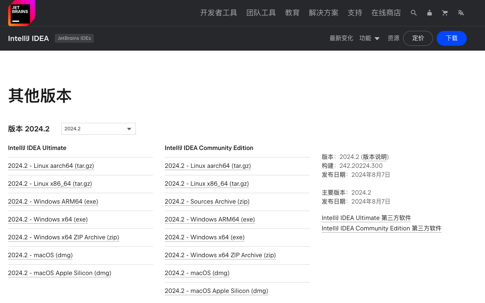
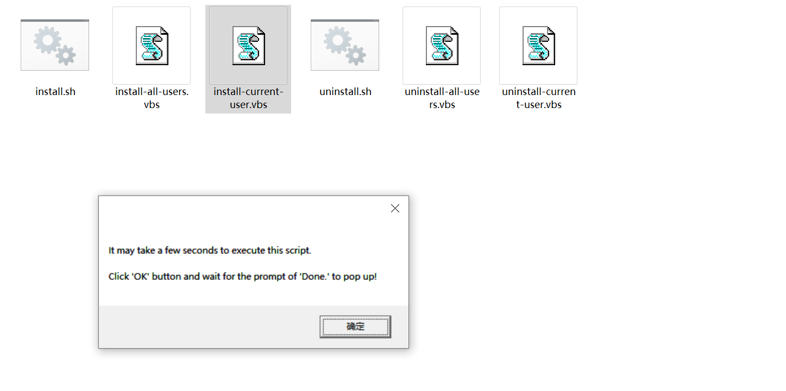

* content
{:toc}
 
&emsp;1、[Jetbrains 官网](https://www.jetbrains.com/zh-cn/ides/#choose-your-ide) 下载安装需要的 IDE，例如 [Intellij IDEA 2024.2](https://www.jetbrains.com/zh-cn/idea/download/other.html)

&emsp;2、访问 [3.jetbra.in](https://3.jetbra.in/) 下载破解脚本，打开网页显示如下，点击其中蓝色显示延时最低的即可

&emsp;3、点击 `Download jetbra.zip` 下载破解脚本，解压放在任意目录即可

&emsp;4、查看解压后的 readme 操作；最新的操作执行 scripts 下的脚本即可；macOS 或 Linux 终端执行 `install.sh`，Windows 双击 `install-current-user.vbs` 即可

&emsp;5、以 Windows 为例，双击 vbs 脚本后，弹窗显示如下，点击 `确定` 按钮即可

&emsp;6、脚本执行成功之后弹窗显示 `Done`，此时破解完成了第一步

&emsp;7、继续回到刚才下载 `jetbra.zip` 的网页，鼠标悬停在对应的 IDE 下的 `*****` 处，点击 `Copy to clipboard` 按钮复制激活码

&emsp;8、打开下载的 IDE，例如 `Intellij IDEA`，在 `Activation code` 处粘贴刚复制的激活码，点击 `Activate` 按钮完成激活；

&emsp;9、激活完成显示过期时间，下次时间到期后，重新复制新的激活码再次激活即可

