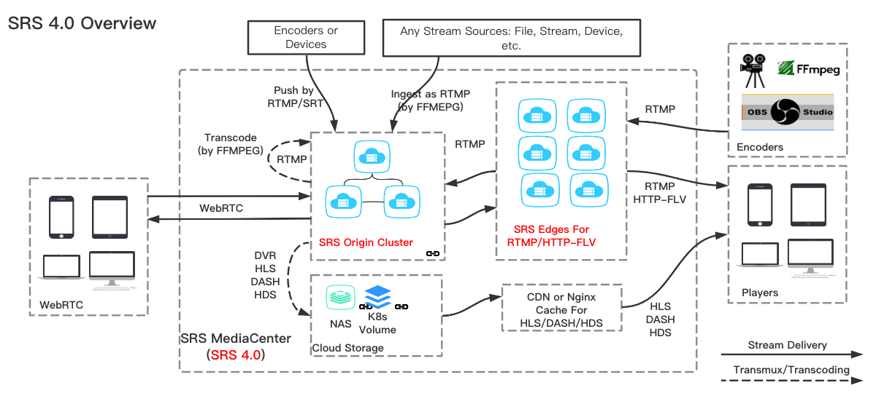
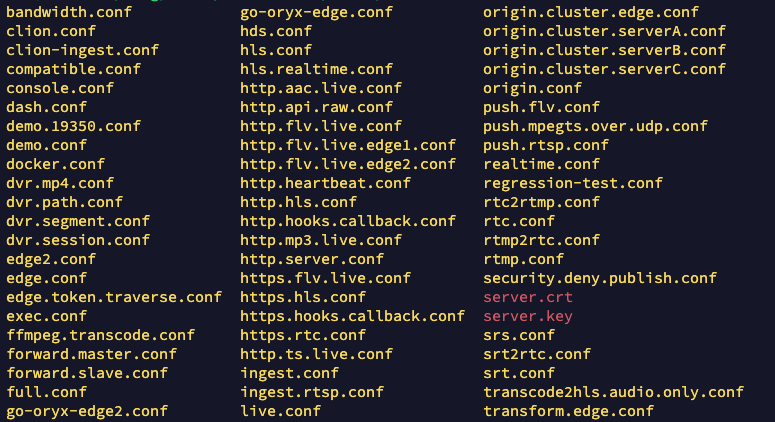
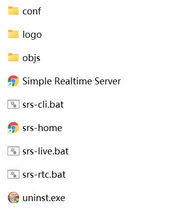
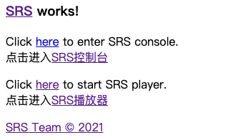

* content
{:toc}

&emsp;&emsp;**SRS** 是一个简单高效的实时视频服务器，支持 `RTMP/WebRTC/HLS/HTTP-FLV/SRT/GB28181`。

## 一、Ubuntu / Mac 系统编译

&emsp;&emsp;Linux 或 Mac 系统可以在 [SRS git 仓库](https://github.com/ossrs/srs/releases) 中，选择对应版本的源码下载进行编译；根据 SRS 对 WebRTC 的支持，源码编译版本选择目前 4.x 最新版 [4.0.198](https://github.com/ossrs/srs/releases/tag/v4.0.198)

- [x] SRS 4.0.14，支持了RTMP推流，WebRTC播放
- [x] SRS 4.0.76，支持了WebRTC推流，WebRTC播放
- [x] SRS 4.0.95，支持了WebRTC推流，RTMP播放
- [x] SRS 4.0.96，一对一通话DEMO
- [x] SRS 4.0.98，多人会议DEMO
- [x] SRS 4.0.98，会议录制，直播连麦DEMO

~~~shell
wget https://github.com/ossrs/srs/archive/refs/tags/v4.0.198.tar.gz
tar -xvf v4.0.198.tar.gz
cd srs-4.0.198/trunk
./configure   # Mac 执行 ./configure --osx
make    # 不需要 make install
~~~

&emsp;&emsp;make 编译完之后，会出现如下提示，即告诉我们如何指定配置文件启动 SRS 服务：

~~~shell
You can:
      ./objs/srs -c conf/srs.conf
                  to start the srs server, with config conf/srs.conf.
~~~

 

## 二、Windows 安装

&emsp;&emsp;Windows 系统，可以下载 [Windows(Cygwin)安装包](https://github.com/ossrs/srs/releases/download/v5.0.19/SRS-Windows-x86_64-5.0.19-setup.exe)，双击运行安装之后，得到的目录结构如下：

&emsp;&emsp;同样的，一些默认的配置文件都在 conf 目录下；启动 SRS 服务也和 Linux / Mac 类似；打开终端，进入到 SRS 目录，执行如下指令

~~~shell
objs\srs.exe -c conf\rtmp2rtc.conf
~~~

&emsp;&emsp;SRS 目录下有三个 .bat 脚本文件，可以通过记事本打开，发现其对应的命令如下：

> - **srs-cli.bat:** `objs\srs.exe -h`
> - **srs-live.bat:** `objs\srs.exe -c conf\live.conf`
> - **srs-rtc.bat:** `objs\srs.exe -c conf\rtc.conf`

 

## 三、参数配置

~~~nginx
listen              1935;
max_connections     1000;
daemon              off;
srs_log_tank        console;

http_server {
    enabled         on;
    listen          8080;
    dir             ./objs/nginx/html;
}

http_api {
    enabled         on;
    listen          1985;
}
stats {
    network         0;
}
rtc_server {
    enabled on;
    listen 8000;
    # @see https://github.com/ossrs/srs/wiki/v4_CN_WebRTC#config-candidate
    candidate $CANDIDATE;
}

vhost __defaultVhost__ {
    rtc {
        enabled     on;
        # @see https://github.com/ossrs/srs/wiki/v4_CN_WebRTC#rtmp-to-rtc
        rtmp_to_rtc on;
        # @see https://github.com/ossrs/srs/wiki/v4_CN_WebRTC#rtc-to-rtmp
        rtc_to_rtmp on;
    }
    http_remux {
        enabled     on;
        mount       [vhost]/[app]/[stream].flv;
    }
}
~~~

- **max_connections** 默认值 1000，Mac 系统启动时，可能导致如下错误，需要将其设置到 248 或以下：

> invalid max_connections=1000, required=1107, system limit to 256, total=1007(max_connections=1000, nb_consumed_fds=7). you can change max_connections from 1000 to 248, or you can login as root and set the limit: ulimit -HSn 1107

- **candidate** 当我们开启 WebRTC 功能的时候，**`一定一定`**需要 [配置 candidate](https://github.com/ossrs/srs/wiki/v4_CN_WebRTC#config-candidate)；官方提供的配置方式如下：

> - 直接配置成固定的IP，比如：candidate 192.168.3.6;
> - 用命令ifconfig获取本机的内网IP，通过环境变量传递给SRS，比如：candidate $CANDIDATE;
> - 自动获取，先读取环境变量，然后获取本机网卡的IP，比如：candidate *;
> - 在url中通过?eip=x指定，比如：webrtc://192.168.3.6/live/livestream?eip=192.168.3.6

- **rtmp_to_rtc** WebRTC 可以作为直播的一个播放器，播放直播流，延迟比 RTMP 还要低，更能抗网络抖动。

- **rtc_to_rtmp** WebRTC 推流，可以转成 RTMP 流播放，SRS 只会对音频转码（Opus 转 AAC），因此要求视频是 H.264 编码。

 

## 四、FFmpeg 直播推流

&emsp;&emsp;srs 服务的 ./doc/ 目录下，存在 `source.flv` 和 `source.200kbps.768x320.flv` 两个测试视频

- FFmpeg 推流指令：

~~~shell
ffmpeg -re -i ./doc/source.flv -c copy -f flv rtmp://localhost:1935/live/livestream
~~~

- FFmpeg 播放指令：

~~~shell
ffplay -i rtmp://localhost:1935/live/livestream
~~~

&emsp;&emsp;服务启动成功之后，可以在浏览器输入 [localhost:8080](http://localhost:8080/) 进入 SRS 管理后台

&emsp;&emsp;而如果启动的 srs 服务开启了 rtc 功能，可以在 SRS 播放器中测试直播流的播放，rtmp 直播流也可以使用 **vlc** 播放器播放，Windows 平台还可以使用 **PotPlayer** 播放