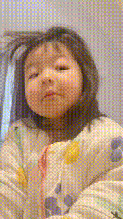
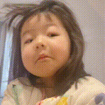
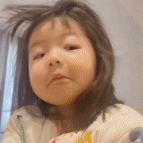

* content
{:toc}

[**`wangZiMei.mp4 视频链接`**](../../../assets/videos/wangZiMei.mp4)

## 一、表情包制作

#### &emsp;**1、最简单的方式 —— 全部转换**

~~~shell
ffmpeg -i wangZiMei.mp4 wzm-1.gif
~~~

&emsp;&emsp;上面的方式，会将整个视频转成 gif，并且文件大小 `离了个特朗普`，视频大小 3.58 M，转换之后的 gif 大小为 111 M；

#### &emsp;**2、截取某段时间视频**

&emsp;&emsp;上面第一种方式是将整个视频转换 gif，但是真正想要用作表情包的片段可能就几秒钟，因此添加两个参数：

> &emsp;-ss：指定视频的开始时间
> &emsp;-t：指定从开始时间截取的时长

&emsp;&emsp;两个参数并非必须一起使用，省略 `-ss` 表示从 0 秒开始，省略 `-t` 则是从当前 `-ss` 开始时间直到视频结束；例如从第 7.4 秒开始，截取 3 秒钟的区域，对应指令如下：

~~~shell
ffmpeg -i wangZiMei.mp4 -ss 7.400 -t 3 wzm-2.gif
~~~

&emsp;&emsp;上面两个参数时间单位是 **`秒`**，存在两种表现格式：

> [HH]:[mm]:SS.[sss]    时分秒格式，除了秒数，其他的可以省略；例如 01:50 (1分50秒)
> S.[sss]    秒数格式；例如 7.4 秒；110 秒（1分50秒）

#### &emsp;**3、调整图片尺寸**

&emsp;&emsp;上面的截取一段区域，文件还是有 17.8 M，比完整的视频文件还大，因此添加 **`-s`** 参数，用于指定图片的宽高，此时 gif 如下，大小为 1.35 M；

~~~shell
ffmpeg -i wangZiMei.mp4 -ss 7.400 -t 3 -s 180x320 wzm-3.gif
~~~

&emsp;&emsp;而除了上面的 **`-s`** 指定宽高，还可以通过 `filter` 控制 scale 参数达到缩放效果；

~~~shell
# 指定宽 180、高 320
ffmpeg -i wangZiMei.mp4 -ss 7.400 -t 3 -vf scale=w=180:h=320 wzm-3.gif
# 省略宽高参数 w、h
ffmpeg -i wangZiMei.mp4 -ss 7.400 -t 3 -vf scale=180:320 wzm-3.gif
# 省略宽高参数 w、h；以 -1 代替高，将根据视频的分辨率和指定的宽度 180，按比例计算出高度值
ffmpeg -i wangZiMei.mp4 -ss 7.400 -t 3 -vf scale=180:-1 wzm-3.gif
# 省略宽高参数 w、h；以 -1 代替宽，将根据视频的分辨率和指定的高度 320，按比例计算出宽度值
ffmpeg -i wangZiMei.mp4 -ss 7.400 -t 3 -vf scale=-1:320 wzm-3.gif
~~~

#### &emsp;&emsp;**4、截取视频指定区域**

&emsp;&emsp;作为一个合格的表情包，常见的是正方形，因此，基于上面的调整尺寸之后，再加入 `filter` 的 crop 参数，裁切出指定的像素区域：

~~~shell
ffmpeg -i wangZiMei.mp4 -ss 7.400 -t 3 -vf scale=w=180:h=320,crop=w=180:h=180:x=0:y=40 wzm-4.gif
~~~

- w: 宽度
- h：高度
- x：裁切开始的 x 坐标（左 0 右 宽）
- y：裁切开始的 y 坐标（上 0 下 高）

#### &emsp;&emsp;**5、调整帧数**

&emsp;&emsp;当不指定帧数时、生成的 gif 使用的是原视频的帧数，此处为 FPS 为 30，此时可以通过如下方式，将 gif 的帧数调成 15

~~~shell
# 使用 -r 参数指定帧数为 15
ffmpeg -i wangZiMei.mp4 -ss 7.400 -t 3 -r 15 -vf scale=w=180:h=320,crop=w=180:h=180:x=0:y=40 wzm-5.gif
# 使用 filter 的 fps 参数指定帧数为 15
ffmpeg -i wangZiMei.mp4 -ss 7.400 -t 3 -vf fps=15,scale=w=180:h=320,crop=w=180:h=180:x=0:y=40 wzm-5.gif
~~~

## 二、gif 图高清处理

&emsp;&emsp;上面生成的图片，虽然大小减少了，但是对应清晰度也降低了；因此，调整缩放为 `spline` 算法先生成 16 x 16 像素的调色板图片；

~~~shell
ffmpeg -i wangZiMei.mp4 -vf "fps=15,crop=w=720:h=720:x=0:y=160,scale=180:320:flags=spline,palettegen" wzm-调色板.png
~~~

&emsp;&emsp;注意使用上面的指令时； `-ss` 指令不要加上，否则无法生成图片；而 crop 裁剪参数也需要放在 scale 前面；但是放在前面的时候是以还未缩放时的尺寸裁剪的；

&emsp;&emsp;而是用下面的指令通过`调色板`图片生成高清动图时，最好把 crop 放在后面；测试时发现放在 scale 前面生成的 gif，播放时被拉伸了

~~~shell
ffmpeg -i wangZiMei.mp4 -i wzm-调色板.png -ss 7.400 -t 3 -filter_complex "fps=15,scale=180:320:flags=spline[a];[a][1:v] paletteuse,crop=w=180:h=180:x=0:y=40" wzm-6.gif
~~~

&emsp;&emsp;如下指令，可以实现上面两条指令的同样效果：

~~~shell
ffmpeg -i wangZiMei.mp4 -ss 7.400 -t 3 -vf "fps=15,scale=180:320:flags=spline,split[a][b];[a]palettegen[p];[b][p]paletteuse,crop=w=180:h=180:x=0:y=40" wzm-6.gif
~~~