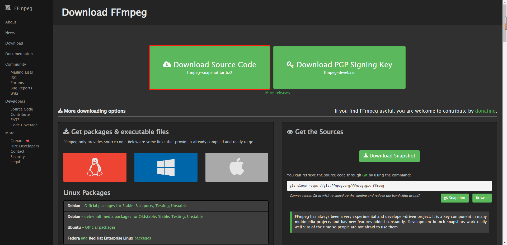
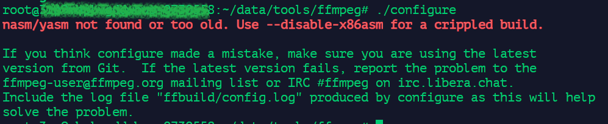
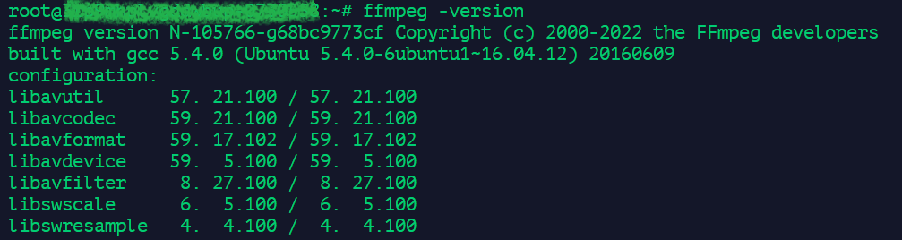
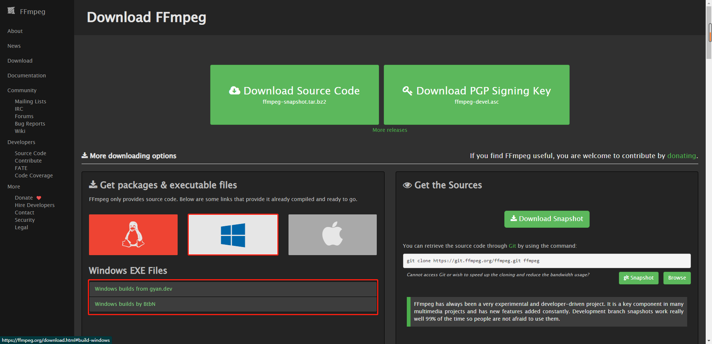
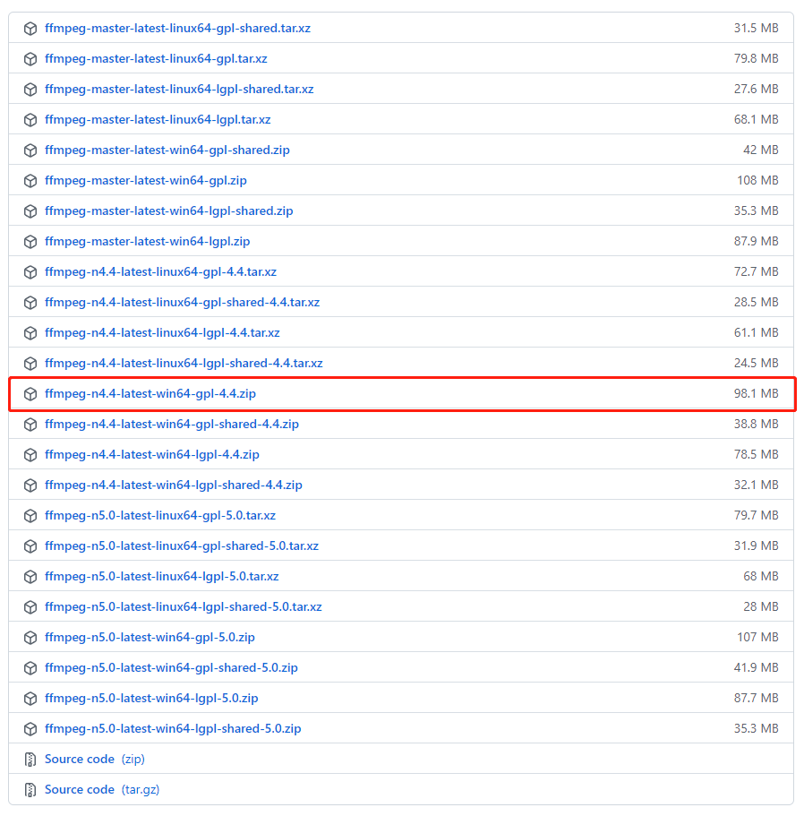
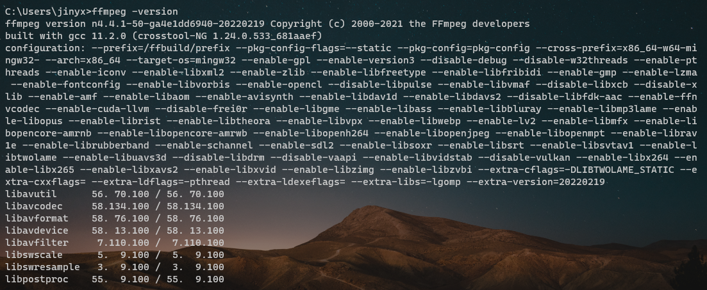

* content
{:toc}

## 一、Ubuntu / Mac 编译安装

**1**、打开 [FFmpeg 官网](https://ffmpeg.org/download.html)，点击 `Download Source Code` 下载源码进行编译安装

**2**、`tar -xvf ffmpeg-snapshot.tar.bz2` 解压源码压缩包，并 cd 进入解压目录

**3**、`./configure` 编译安装可能会出现如下错误

~~~shell
nasm/yasm not found or too old. Use --disable-x86asm for a crippled build.
~~~

&emsp;&emsp;可以先安装编译 yasm：

~~~shell
wget http://www.tortall.net/projects/yasm/releases/yasm-1.3.0.tar.gz
tar -xvf yasm-1.3.0.tar.gz
cd yasm-1.3.0
./configure
make
make install
~~~

 &emsp;&emsp;此时再编译安装 ffmpeg：

~~~shell
cd ffmpeg
./configure
make
make install
~~~

&emsp;&emsp;最后输入 `ffmpeg -version` 得到如下信息表示安装成功

 

## 二、Windows 解压安装

**1**、打开 [FFmpeg 官网](https://ffmpeg.org/download.html)，点击下方 Windows 图标去获取可执行文件

**2**、以第二个 [Windows builds by BtbN](https://github.com/BtbN/FFmpeg-Builds/releases) 为例：

&emsp;&emsp;选择 `n4.4` 的版本；其中 `gpl` 和 `lgpl` 是两个开源授权的协议。

**3**、下载完成之后直接解压缩到 Windows 的目录即可，然后将 `${磁盘路径}\ffmpeg-n4.4-latest-win64-gpl-4.4\bin` ffmpeg 的 bin 目录配置到环境变量的 path 变量中

**4**、同样的，执行 `ffmpeg -version` 验证安装时候完成

